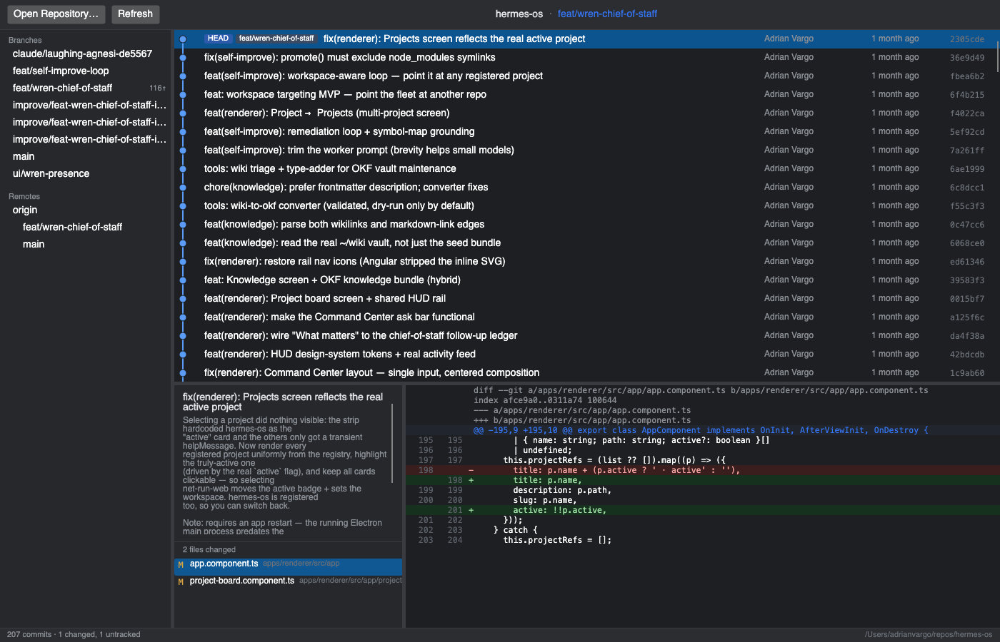

# GitFork

A visual Git client for .NET, modelled on [Fork](https://git-fork.com/) — built so the same
workflow is available under an MIT licence with no procurement barrier.

Cross-platform (Windows, macOS, Linux) via Avalonia. Talks to your own `git` binary, so it honours
your existing config, credential helpers, hooks and LFS setup exactly.



## Current state

Milestone 1 is complete: a read-only repository browser.

- Coloured, laned commit graph with merge rings and branch/tag badges
- Sidebar of local branches, remotes, tags and stashes with ahead/behind indicators
- Commit detail pane with the full message and changed-file list
- Unified diff with per-side line numbers and add/remove colouring

Nothing in the UI writes to your repository yet. See [docs/ROADMAP.md](docs/ROADMAP.md).

## Running it

Requires the [.NET 10 SDK](https://dotnet.microsoft.com/download) and `git` on your `PATH`.

```bash
dotnet run --project src/GitFork.App
```

Then use **Open Repository…** and pick any folder inside a git work tree.

## Tests

```bash
dotnet test
```

The suite includes integration tests that create throwaway repositories in your temp directory and
run the real `git` binary against them.

## Screenshots

The screenshot above is generated headlessly, so it can be refreshed without launching the app:

```bash
GITFORK_SCREENSHOT=docs/screenshot.png GITFORK_SCREENSHOT_REPO=/path/to/repo dotnet test tests/GitFork.App.Tests --filter WriteScreenshot
```

## Static analysis

`SonarAnalyzer.CSharp` and the .NET analyzers run on every build at `AnalysisMode=Recommended`, so
`dotnet build` surfaces Sonar findings locally with no server involved. To publish to a SonarQube
or SonarCloud instance:

```bash
SONAR_TOKEN=… SONAR_HOST_URL=… ./scripts/sonar-scan.sh
```

## Layout

```
src/GitFork.Core   git process wrapper, output parsers, commit-graph layout (no UI dependencies)
src/GitFork.App    Avalonia views, view models, custom graph renderer
tests/GitFork.Core.Tests  parser, graph-layout and real-git integration tests
tests/GitFork.App.Tests   headless Avalonia tests that render the window and inspect pixels
docs/SPEC.md       architecture and design rationale
docs/ROADMAP.md    milestone plan
```

## Licence

MIT. See [LICENSE](LICENSE).
