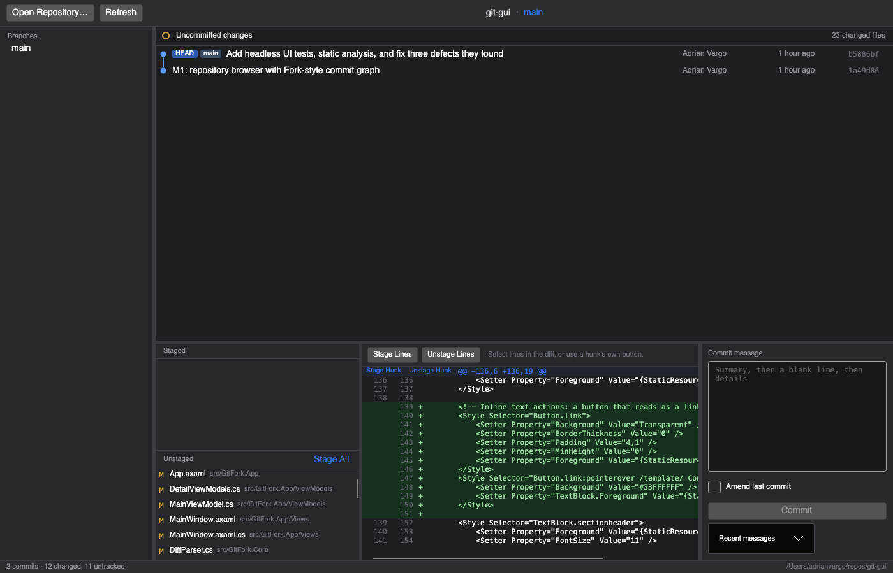
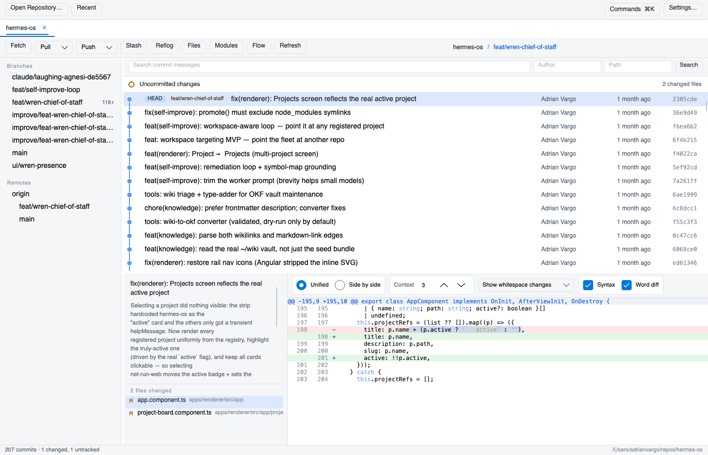
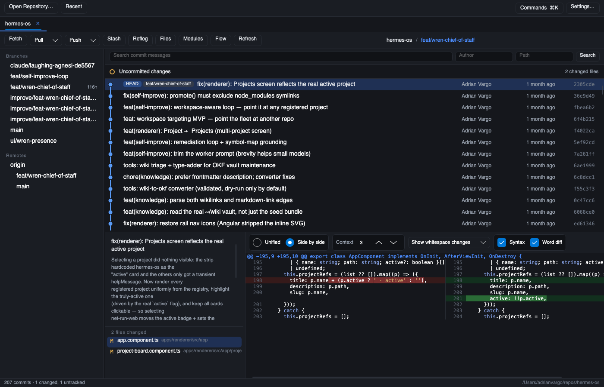
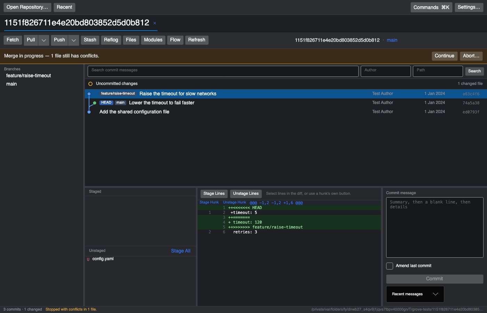

# GitFork

A visual Git client for .NET, modelled on [Fork](https://git-fork.com/) — built so the same
workflow is available under an MIT licence with no procurement barrier.

Cross-platform (Windows, macOS, Linux) via Avalonia. Talks to your own `git` binary, so it honours
your existing config, credential helpers, hooks and LFS setup exactly.


The staging pane, with hunk- and line-level staging:



The light theme:



Side-by-side, with word-level and syntax colouring:



A conflicted merge, with the way out offered up front:



## Current state

All six milestones are complete. See [docs/ROADMAP.md](docs/ROADMAP.md) for what was built and
what was deliberately left out.

**Browsing**

- Coloured, laned commit graph with merge rings and branch/tag badges
- Sidebar of local branches, remotes, tags and stashes with ahead/behind indicators
- Commit detail pane with the full message and changed-file list
- Unified diff with per-side line numbers and add/remove colouring

**Working copy**

- "Uncommitted changes" pinned at the top of the history, as Fork does
- Staged / unstaged split, with stage, unstage and discard
- Hunk-level and line-level staging
- Commit box with an amend toggle and recent-message recall
- Automatic refresh when the repository changes on disk

**Branches, remotes and history**

- Fetch, pull (merge or rebase) and push, with streamed progress and cancellation
- Checkout, create, rename and delete branches; create and delete tags
- Merge and rebase, with a banner offering Continue or Abort while conflicts remain
- Cherry-pick, revert and reset from the commit context menu
- Stash push, apply, pop and drop

**Reading code**

- Side-by-side and unified diffs, switchable without re-reading anything
- Word-level highlighting, so a one-word edit reads as one word
- Syntax colouring for the common languages, with no extra dependencies
- Adjustable context and whitespace-ignoring modes
- Blame with per-line attribution, and per-file history that follows renames
- Image diffs shown before and after

**Rewriting and recovering**

- Interactive rebase: reorder, squash, fixup, edit and drop, with nothing touched until you start
- Reflog browser that flags commits no branch can reach, and recovers them onto a branch
- Submodule listing and update

**Browsing and integrations**

- Repository file tree at any revision, with contents and syntax colouring
- Git-flow start and finish for features, releases and hotfixes
- Submodule listing and update, and LFS tracked files and locks

**Getting around**

- Several repositories open at once as tabs, with a recent list
- Search history by message, author or path; load more rather than truncating at a fixed cap
- Light and dark themes
- Keyboard shortcuts, and a command palette (⌘K / Ctrl+K) listing every action with its binding

## Running it

Requires the [.NET 10 SDK](https://dotnet.microsoft.com/download) and `git` on your `PATH`.

```bash
dotnet run --project src/GitFork.App
```

Then use **Open Repository…** and pick any folder inside a git work tree.

## Building a release

```bash
./scripts/publish.sh            # for this machine
./scripts/publish.sh win-x64    # or any runtime identifier
./scripts/publish-all.sh        # every supported platform
```

Builds are self-contained, so the result runs without a .NET runtime installed — which is the
point, given the licensing constraint this project exists for. Windows and Linux get a single
executable; macOS gets a `.app` bundle, because recent macOS kills a bare adhoc-signed executable
on launch without explanation.

## Tests

```bash
dotnet test
```

The suite includes integration tests that create throwaway repositories in your temp directory and
run the real `git` binary against them.

## Screenshots

The screenshot above is generated headlessly, so it can be refreshed without launching the app:

```bash
GITFORK_SCREENSHOT=docs/screenshot.png GITFORK_SCREENSHOT_REPO=/path/to/repo dotnet test tests/GitFork.App.Tests --filter WriteScreenshot
```

## Static analysis

`SonarAnalyzer.CSharp` and the .NET analyzers run on every build at `AnalysisMode=Recommended`, so
`dotnet build` surfaces Sonar findings locally with no server involved. To publish to a SonarQube
or SonarCloud instance:

```bash
SONAR_TOKEN=… SONAR_HOST_URL=… ./scripts/sonar-scan.sh
```

## Layout

```
src/GitFork.Core   git process wrapper, output parsers, commit-graph layout (no UI dependencies)
src/GitFork.App    Avalonia views, view models, custom graph renderer
tests/GitFork.Core.Tests  parser, graph-layout and real-git integration tests
tests/GitFork.App.Tests   headless Avalonia tests that render the window and inspect pixels
docs/SPEC.md       architecture and design rationale
docs/ROADMAP.md    milestone plan
```

## Credentials

GitFork never handles your credentials. Git is run with terminal prompting disabled, so
authentication comes from your existing credential helper or SSH key — and a missing credential
fails immediately with an explanation instead of hanging.

## Licence

MIT. See [LICENSE](LICENSE).
